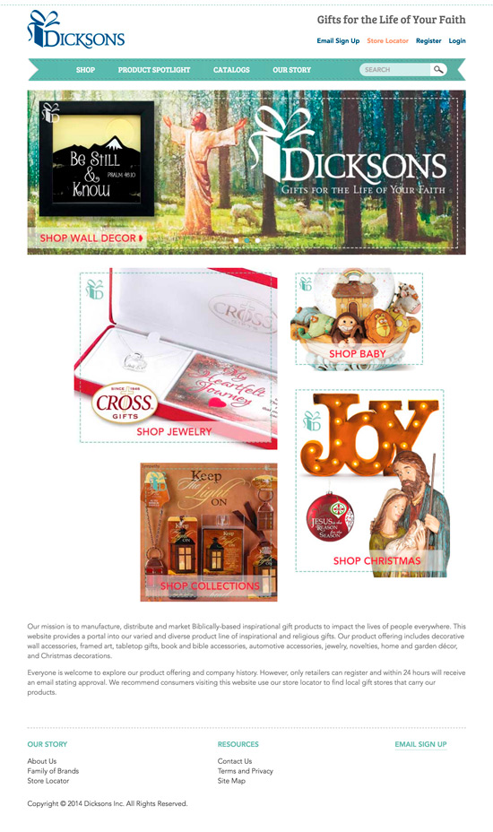
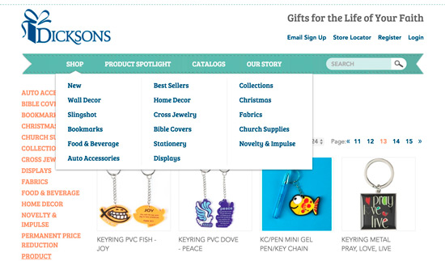
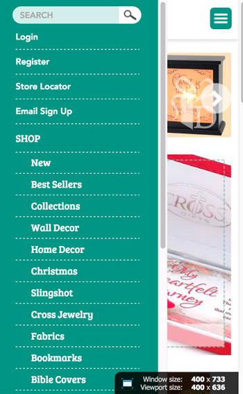
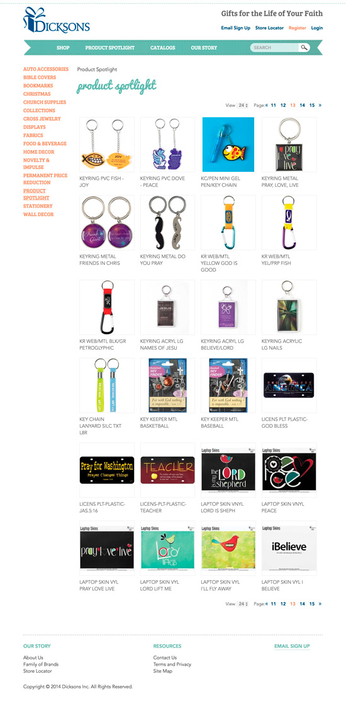
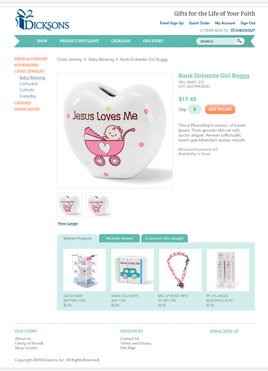
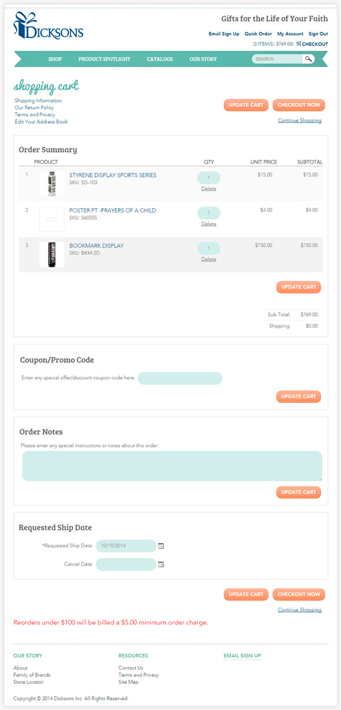
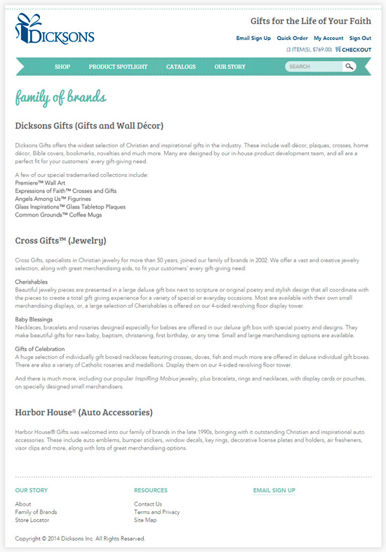

# Dicksons Gifts

## About
This is a past project for which I built the front end based on design mockups. The project involved developing the front end of the site and integrated it with the shopping cart platform.  

I didn't keep the code then but have uploaded the screenshots to demonstrate the scope of the work.

## Tech Stack

**Languages:** HTML, CSS, Javascript/jQuery   
**Framework:** ASP.NET

## Screenshots

### Home Page

    

 

### Navigation Dropdown

    

 
 

### Mobile Menu

    

 
 

### Category Page

    

 

### Product Details Page

    

 

### Shopping Cart

    

 

### Contact Us Page

    

 

### Policy Page

    

 

## Site URL
[https://www.dicksonsgifts.com/](https://www.dicksonsgifts.com/)  
